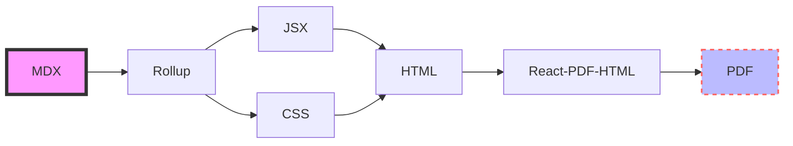

# MDX-CV Fast Pipeline

这是一个将 MDX 格式的文件转换为 PDF 输出的工具，因为使用了现成的工具，所以叫 fast pipeline。

它的流程是这样的：

1. 使用 @mdx-js/rollup 将 mdx 文件转译打包成 jsx 文件
   a. 使用 esbuild 编译引用的 script
   b. 使用自定义 css 处理插件，提取 css 文本并注入到 style 标签，为静态渲染做准备
2. 使用 react-dom/server 将上面的 jsx 文件渲染为静态 html 文件
3. 使用 react-pdf-html 和 react-pdf 快速从 html 生成 PDF

整体流程为：



其中遇到的问题：

- rollup 生态陈旧。不过一开始尝试的是 esbuild，但生态是比“陈旧”更严重的“缺失”，后来因为 rollup 本身比较简单，最终选择 rollup 来进行自定义的 bundle 工作
- 在使用 react-pdf-html 进行 html 转换时，发现它有很多对 html 的支持并不完整的地方，例如：
  - css 样式不支持层叠，这是个小 bug，已被 patch 修复
  - 不支持 link 本地文件，通过读取注入 css 文本到 style 标签解决
  - 没有处理正确的 layout 模型，普通的样式不能随便传入，如给 strong 设置了绝对定位
  - 没有处理正确的 css 单位，如 em 单位，需要自行转换。最终加了一个处理 css 转换的函数

随着遇到的坑越来越多，发现 react-pdf-html 底层有很多不完善的地方，再加上这是一个不活跃的小项目。整个流程也越来越不 fast, 最终决定还是回到从 mdx -> react jsx -> react-pdf custom component -> PDF 的流程上。中间不经过 HTML 流程，也没有使用 react 中间过程，因为 react-pdf 是和 react-dom 同一层的适配层，直接用 react 语法写 PDF。最终的流程简化为 MDX -> React-PDF -> PDF。

## 使用方法

```bash
pnpm install
pnpm -F fast-pipeline start -h
```
